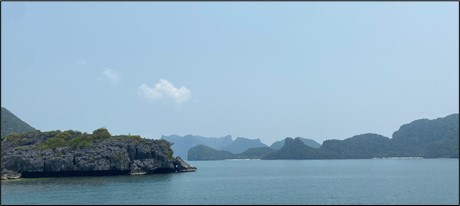
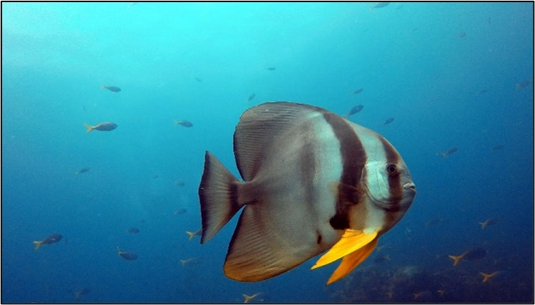

+++
title = "Tiefenrausch - Eine Reise unter den Meeresspiegel"
date = "2023-06-15"
draft = false
pinned = false
image = ""
description = "Die Unterwasserwelt birgt faszinierende Wunder und Herausforderungen, von farbenprächtigen Korallenriffen bis hin zu atemberaubenden Meeresbewohnern. Es ermöglicht Abenteuer in einer anderen Dimension voller Schönheit aber auch Herausforderungen."
+++

Die Sonne spiegelt sich auf der glitzernden Oberfläche des türkisblauen Meeres wider, während sich eine Gruppe von Tauchern auf das bevorstehende Abenteuer vorbereitet. Die schwere Ausrüstung festgeschnallt, ein grosser Schritt nach vorne und schon ist man umgeben von Blau. Mit ruhigen Atemzügen und Flossenschlägen schweben sie durch das Wasser. Es ist nichts zu hören außer die schillernden Luftblasen, die an den Köpfen vorbei zur Oberfläche blubbern oder das Knacken und Knistern eines Korallenriffs. Die Wellen sind eine Grenze zwischen zwei Welten, die unterschiedlicher nicht sein könnten und Taucher sind diejenigen, die abtauchen und dieses Geheimnis lüften können. Die Unterwasserwelt ist voller Wunder, von farbenfrohen Korallenriffen bis hin zu zerfallenen Wracks. Jeder Tauchgang ist ein einzigartiges Abenteuer, das die Taucher auf eine Reise ins Unbekannte mitnimmt.

Das Scuba Diving, auch bekannt als Sporttauchen, ermöglicht es Menschen, in eine andere Dimension einzutauchen und die faszinierende Schönheit der Unterwasserwelt zu erkunden. Doch hinter diesem scheinbar mühelosen Unterwassererlebnis verbirgt sich eine Welt voller Herausforderungen und spannender Entdeckungen.

 

**Die richtige Ausrüstung - Eine vertrauenswürdige Begleitung unter Wasser**

Bevor sich die Taucher in die Tiefen des Ozeans wagen, ist eine gründliche Vorbereitung von entscheidender Bedeutung. «Um mich auf einen Tauchausflug vorzubereiten, überprüfe ich als Erstes meine Tauchausrüstung, um sicherzustellen, dass alles funktioniert und in gutem Zustand ist», berichtet Mena, Padi OWSI und EFR Instructor auf Koh Samui. Die richtige Ausrüstung spielt eine zentrale Rolle. Von den Tauchflaschen über die Atemregler bis hin zu den Flossen und dem Tauchanzug - jedes einzelne Teil der Ausrüstung wurde entwickelt, um den Tauchern Sicherheit und Komfort zu bieten. Die Tauchflaschen sind mit Pressluft gefüllt und ermöglichen es den Tauchern, unter Wasser zu atmen, während die Atemregler den Druck des Atems anpassen und ein einfaches Atmen gewährleisten. Die Flossen sorgen für eine leichte Fortbewegung und der Tauchanzug schützt die Taucher vor Kälte und bietet Auftrieb. Doch es bedarf auch einer gründlichen Einweisung und regelmäßigen Checks der Ausrüstung, um einen sicheren Tauchgang zu gewährleisten.

Taucher setzen ihr Vertrauen in ihre Ausrüstung und wissen, dass sie auf sie zählen können, um sie sicher durch die Unterwasserwelt zu begleiten. Doch sie verstehen auch die Bedeutung der eigenen Fähigkeiten und des Trainings. Vor dem ersten Tauchgang absolvieren Taucher einen Tauchkurs, beispielsweise den OWD (Open Water Diver), um die grundlegenden Techniken und Sicherheitsmaßnahmen zu erlernen. Sie üben das Atmen unter Wasser, die richtige Handhabung der Ausrüstung und das gemeinsame Tauchen in einer Gruppe. Durch wiederholtes Training und Übung entwickeln Taucher ein Gefühl der Sicherheit und Vertrautheit mit ihrer Ausrüstung, was ihnen ermöglicht, sich ganz auf die Erkundung der Unterwasserwelt zu konzentrieren.

**Eine faszinierende Unterwasserwelt**

Sobald die Taucher bereit sind, tauchen sie in eine neue Welt ein, die mit Leben und Farbenpracht erfüllt ist. Korallenriffe, die sich in lebendigen Farben erstrecken, dienen als Heimat für eine Vielzahl von Meeresbewohnern. Bunte Fische in allen Größen und Formen ziehen anmutig vorbei, während Schildkröten gemächlich durch das Wasser gleiten. Anderswo schweben Mantar

ochen majestätisch über den Sandboden, während verspielte Delfine die Taucher mit ihrer Neugierde begrüßen. Das Tauchen bietet eine einzigartige Möglichkeit, diese faszinierenden Meeresbewohner in ihrem natürlichen Lebensraum zu beobachten und unvergessliche Begegnungen zu erleben. Die Stille unter Wasser lässt die Taucher in einsinken in ein Umfeld, in dem sie sich eins fühlen mit der Natur und dem Rhythmus des Ozeans.

**Herausforderungen und Verantwortung**

Obwohl das Tauchen aufregende Abenteuer bietet, sind die Taucher auch mit Herausforderungen und Verantwortung konfrontiert. Sie sind oft die ersten Zeugen der Auswirkungen von Umweltverschmutzung und Klimawandel auf die Unterwasserwelt. Der Schutz der Unterwasserwelt und ihrer empfindlichen Ökosysteme ist von größter Bedeutung. Taucher sollten darauf achten, keine Spuren ihres Aufenthalts im Meer zurückzulassen. Zudem sollten sie die geltenden Tauchregeln und -grenzen respektieren, um sowohl ihre eigene Sicherheit als auch die der marinen Ökosysteme zu wahren. Um die Unterwasserwelt für zukünftige Generationen zu erhalten, engagieren sich viele Taucher in Naturschutzprojekten und setzen sich aktiv für den Schutz der Meere ein.

Das Tauchen mag wie ein aufregendes Abenteuer erscheinen, doch es erfordert auch ein hohes Maß an Sicherheit und Training. Taucher müssen sich bewusst sein, dass sie in einer fremden Umgebung agieren, in der es potenzielle Gefahren gibt. Daher ist es von entscheidender Bedeutung, dass Taucher die richtigen Sicherheitsprotokolle und -verfahren befolgen. Dies beinhaltet die Kontrolle der Ausrüstung vor jedem Tauchgang, die Überprüfung des Tauchpartners und das Verständnis von Notfallmaßnahmen. Taucher sollten außerdem über ihre eigenen Grenzen Bescheid wissen und nicht übermütig werden. Indem sie sich einer professionellen Tauchschule oder einem qualifizierten Tauchlehrer anschließen, können sie die notwendigen Fähigkeiten erlernen und ihr Wissen über Sicherheitsverfahren vertiefen. So wird das Tauchen zu einem verantwortungsvollen Abenteuer, das ihnen ermöglicht, die Unterwasserwelt sicher und bewusst zu erkunden.

**Tauchen als therapeutisches Erlebnis - Heilende Kräfte der Unterwasserwelt**

Tauchen kann nicht nur ein aufregendes Abenteuer sein, sondern auch therapeutische Wirkung haben. Das Eintauchen in die Unterwasserwelt kann Stress abbauen und die Sinne beruhigen. «Die entspannte Atmosphäre und das klare Wasser schaffen wirklich eine meditative Umgebung, mit der ich den Stress des Alltags hinter mir lassen kann», äussert Mena. Menschen mit körperlichen oder psychischen Herausforderungen finden im Tauchen oft eine besondere Form der Rehabilitation und des Wohlbefindens. Das Gewichtslosigkeitsgefühl unter Wasser kann Schmerzen lindern und die Beweglichkeit fördern. Zudem kann das Beobachten der faszinierenden Meeresbewohner und die Stille unter Wasser eine tiefe Entspannung und innere Ruhe bewirken. Tauchen als therapeutisches Erlebnis hat sich in den letzten Jahren zu einer anerkannten Form der Behandlung entwickelt und wird in vielen spezialisierten Zentren und Programmen angeboten.

**Lebenslange Leidenschaft?**

Für viele Menschen wird das Tauchen zu einer lebenslangen Leidenschaft. Die einzigartigen Erlebnisse, die Verbindung zur Natur und die Abenteuerlust lassen sie immer wieder in die Tiefe hinabsteigen. Mena berichtet von einem Gefühl der Freiheit und des Friedens unter Wasser, das sie nirgendwo sonst findet. Das Tauchen ermöglicht es ihr, den Alltag hinter sich zu lassen und in eine Welt einzutauchen, in der die Zeit stillzustehen scheint. Es ist eine Welt voller Geheimnisse und unentdeckter Schönheit, die nur darauf wartet, von mutigen Tauchern erkundet zu werden.

«Ein häufiges Missverständnis über das Tauchen ist, dass es eine gefährliche Sportart ist. In Wirklichkeit ist das Tauchen sehr sicher, solange man die richtige Ausrüstung trägt und eine angemessene Ausbildung hat», versichert Mena. Das Scuba Diving bietet ein faszinierendes Abenteuer, das Taucher in eine atemberaubende Unterwasserwelt entführt. Mit der richtigen Ausrüstung, Respekt für die Umwelt und einer Portion Abenteuerlust können Taucher unvergessliche Begegnungen mit exotischen Meeresbewohnern erleben und die faszinierende Schönheit der Meere erkunden.